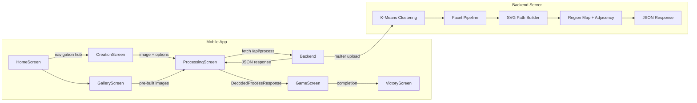
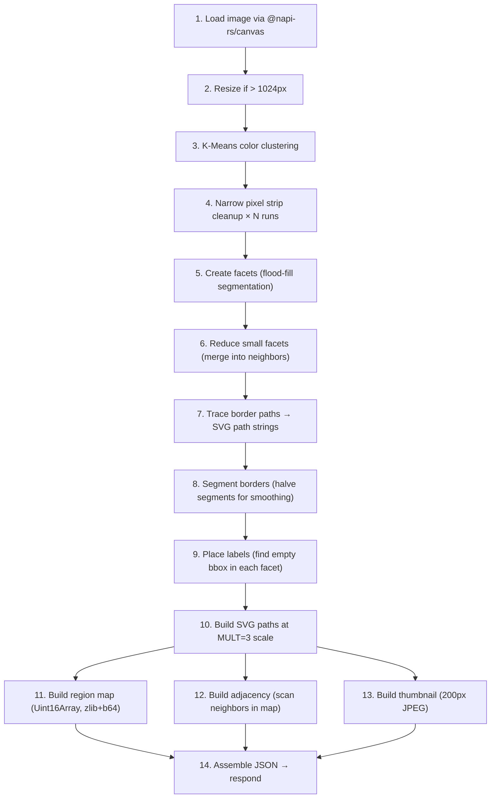
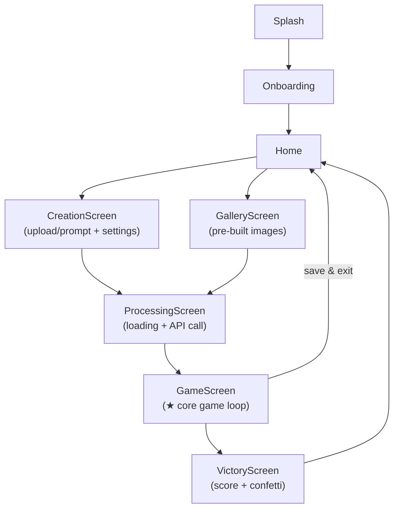
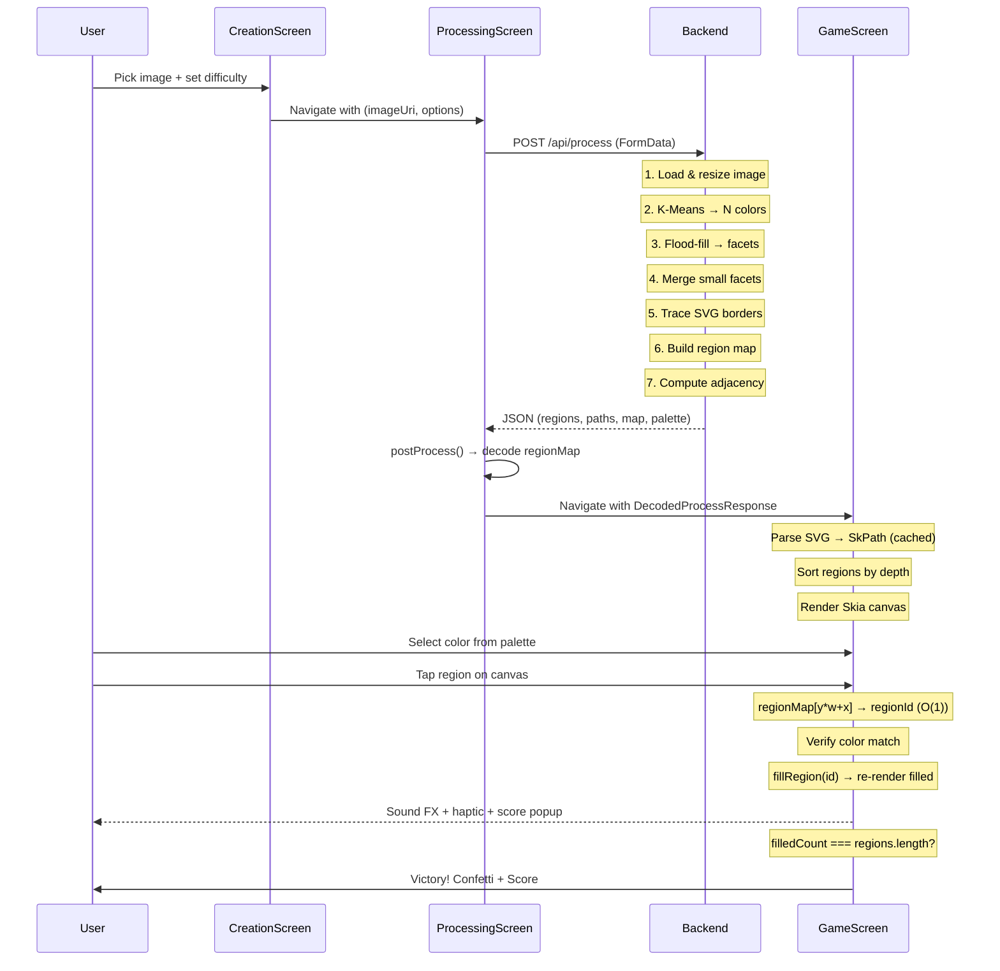

# ColorArt + SquashPaint Backend — Full Codebase Walkthrough

> **Two-repo paint-by-numbers mobile app.**  
> Users pick/upload an image → backend converts it into numbered regions → frontend renders an interactive coloring game with Skia.

---

## Table of Contents

1. [High-Level Architecture](#high-level-architecture)
2. [Backend — `pbn-layered` (SquashPaint)](#backend--pbn-layered-squashpaint)
3. [Frontend — `colorArt` (React Native)](#frontend--colorart-react-native)
4. [Data Flow: Image → Game](#data-flow-image--game)
5. [Key Files Quick Reference](#key-files-quick-reference)

---

## High-Level Architecture



| Layer | Repo | Tech Stack | Deployed |
|-------|------|-----------|----------|
| **Backend** | `pbn-layered-v2/pbn-layered` | Node.js, Express, TypeScript, `@napi-rs/canvas` | Railway (`squashpaintbackend-production.up.railway.app`) |
| **Frontend** | `colorArt` | React Native 0.83, React 19, `@shopify/react-native-skia`, Reanimated 4, Zustand 5 | Android APK |

---

## Backend — `pbn-layered` (SquashPaint)

### Purpose

Takes a raster image upload, quantizes it to N colors via K-Means, segments into facets (regions), traces SVG border paths, and returns a JSON blob the mobile app can render as an interactive paint-by-numbers game.

### Entry Point: [server.ts](file:///c:/Users/sumit/Downloads/pbn-layered-v2/pbn-layered/server.ts)

Single Express server (~530 lines). Two route aliases point to the same handler:

| Route | Method | Purpose |
|-------|--------|---------|
| `POST /api/process` | multipart/form-data (`image` field) | Primary endpoint the app calls |
| `POST /generate` | same | Legacy alias |
| `GET /api/health` / `GET /health` | — | Health check returning `{ status: "ok" }` |

### Processing Pipeline (inside [handleGenerate](file:///c:/Users/sumit/Downloads/pbn-layered-v2/pbn-layered/server.ts#82-294))



### Core Modules (all in [src/](file:///c:/Users/sumit/Downloads/pbn-layered-v2/pbn-layered/src))

| File | Responsibility |
|------|---------------|
| [colorreductionmanagement.ts](file:///c:/Users/sumit/Downloads/pbn-layered-v2/pbn-layered/src/colorreductionmanagement.ts) | K-Means clustering in RGB/HSL/LAB space; narrow pixel strip cleanup; color map creation |
| [facetCreator.ts](file:///c:/Users/sumit/Downloads/pbn-layered-v2/pbn-layered/src/facetCreator.ts) | Flood-fill segmentation → creates facets from quantized color indices |
| [facetReducer.ts](file:///c:/Users/sumit/Downloads/pbn-layered-v2/pbn-layered/src/facetReducer.ts) | Merges small facets into their largest neighbor (removes < N pixel regions) |
| [facetBorderTracer.ts](file:///c:/Users/sumit/Downloads/pbn-layered-v2/pbn-layered/src/facetBorderTracer.ts) | Walks facet boundaries to produce ordered point lists (marching-squares style) |
| [facetBorderSegmenter.ts](file:///c:/Users/sumit/Downloads/pbn-layered-v2/pbn-layered/src/facetBorderSegmenter.ts) | Segments/smooths border paths by halving border segments N times |
| [facetLabelPlacer.ts](file:///c:/Users/sumit/Downloads/pbn-layered-v2/pbn-layered/src/facetLabelPlacer.ts) | Finds the largest interior rectangle in each facet for label placement |
| [facetmanagement.ts](file:///c:/Users/sumit/Downloads/pbn-layered-v2/pbn-layered/src/facetmanagement.ts) | `FacetResult` class — data structure holding the grid of facets |
| [layerExtractor.ts](file:///c:/Users/sumit/Downloads/pbn-layered-v2/pbn-layered/src/layerExtractor.ts) | [FacetPath](file:///c:/Users/sumit/Downloads/pbn-layered-v2/pbn-layered/server.ts#449-490) interface and layer extraction utilities |
| [settings.ts](file:///c:/Users/sumit/Downloads/pbn-layered-v2/pbn-layered/src/settings.ts) | [Settings](file:///c:/Users/sumit/Downloads/pbn-layered-v2/pbn-layered/src/settings.ts#9-32) class — all configurable knobs (cluster count, min facet size, resize dimensions, etc.) |
| [common.ts](file:///c:/Users/sumit/Downloads/pbn-layered-v2/pbn-layered/src/common.ts) | `RGB` type alias (`[number, number, number]`) |

### Settings ([settings.ts](file:///c:/Users/sumit/Downloads/pbn-layered-v2/pbn-layered/src/settings.ts))

```typescript
kMeansNrOfClusters: 16          // Number of colors
kMeansMinDeltaDifference: 1     // K-Means convergence threshold
kMeansClusteringColorSpace: RGB // RGB | HSL | LAB
removeFacetsSmallerThanNrOfPoints: 20  // Min region pixel count
narrowPixelStripCleanupRuns: 3  // Strip cleanup passes
resizeImageWidth: 1024          // Max resize dimension
resizeImageHeight: 1024
nrOfTimesToHalveBorderSegments: 2 // Path smoothing
```

These are overridden by the frontend via the `settings` JSON field and `num_colors` / `min_region_area` form fields.

### Response Shape

The server returns a flat JSON matching the frontend's [ProcessResponse](file:///c:/Users/sumit/colorArt/src/services/api.ts#99-128) interface:

```typescript
{
  width: number,           // SVG coordinate space (= origW × MULT)
  height: number,
  thumbnail_b64: string,   // Base64 JPEG thumbnail
  mega_paths_by_color: { [colorIdx: string]: string },  // Merged SVG paths per color
  regions: Region[],       // Per-region data (id, color, path_data, bbox, label position)
  palette: string[],       // Hex color array
  palette_stats: PaletteStat[],
  adjacency: { [regionId: string]: number[] },
  region_map_b64: string,  // zlib-deflated Uint16Array (1-indexed region IDs), base64
  region_map_width: number,
  region_map_height: number,
  region_map_scale: number, // = MULT (3)
  timing: { ... },
  meta: { ... }
}
```

> [!IMPORTANT]
> The `MULT = 3` scaling factor is fundamental throughout. All SVG paths are in coordinates 3× the original image pixels. The region map is at original resolution. `region_map_scale` tells the frontend how to convert between the two coordinate systems.

### Region Map Deep Dive

The region map enables **O(1) tap detection** on the frontend:

1. Server rasterizes each facet onto a canvas at original resolution  
2. Each facet is drawn with a unique color encoding: `R = high_byte(region_id)`, `G = low_byte(region_id)`  
3. Pixel readback reconstructs `region_id = (R << 8) | G`  
4. The Uint16Array is zlib-compressed then base64-encoded for transmission  
5. Frontend decompresses and uses `regionMap[y * width + x]` for instant tap lookups

---

## Frontend — `colorArt` (React Native)

### Project Structure

```
colorArt/
├── src/
│   ├── assets/gallery/      # Pre-built gallery card images (PNG)
│   ├── components/
│   │   ├── CreateNewButton.tsx    # "Create New" button on home
│   │   ├── CurrencyDisplay.tsx    # Coin counter UI
│   │   ├── CustomTabBar.tsx       # Bottom tab navigator
│   │   ├── DailyRewardModal.tsx   # Daily login reward popup
│   │   ├── DifficultySlider.tsx   # Difficulty control on creation screen
│   │   ├── GameProgressBar.tsx    # In-game progress indicator
│   │   ├── RegionSlider.tsx       # Region count control slider
│   │   ├── SaveProgressModal.tsx  # "Save before leaving?" modal
│   │   └── StyleCard.tsx          # Art style selector card
│   ├── navigation/               # React Navigation setup
│   ├── screens/
│   │   ├── HomeScreen.tsx         # Main hub with daily rewards + quick actions
│   │   ├── CreationScreen.tsx     # Image upload/prompt + difficulty config
│   │   ├── ProcessingScreen.tsx   # Loading state while backend processes
│   │   ├── GalleryScreen.tsx      # Pre-built image gallery with categories
│   │   ├── GameScreen.tsx         # ★ Core game — Skia canvas + paint mechanics
│   │   ├── VictoryScreen.tsx      # Completion celebration with confetti + score
│   │   ├── ProfileScreen.tsx      # User profile (stub)
│   │   ├── SplashScreen.tsx       # App boot splash
│   │   └── OnboardingScreen.tsx   # First-run tutorial
│   ├── services/
│   │   ├── api.ts                 # Backend HTTP communication layer
│   │   └── AudioManager.ts        # Background music + SFX manager
│   ├── store/
│   │   ├── index.ts               # Store barrel export
│   │   ├── mmkvStorage.ts         # MMKV-backed Zustand persistence adapter
│   │   ├── useGameStore.ts        # Current game session state
│   │   ├── usePaintingStore.ts    # Saved paintings / in-progress persistence
│   │   └── useUserStore.ts        # Coins, energy, streaks, achievements, settings
│   └── theme/
│       └── index.ts               # Design tokens (colors, spacing, fonts, shadows)
```

### Screen Flow



### Key Screen Details

#### GameScreen — [GameScreen.tsx](file:///c:/Users/sumit/colorArt/src/screens/GameScreen.tsx) (1277 lines)

This is the largest and most complex file. Major architectural features:

| Feature | Implementation |
|---------|---------------|
| **O(1) Tap Detection** | [RegionMapTapDetector](file:///c:/Users/sumit/colorArt/src/screens/GameScreen.tsx#227-307) class — converts canvas tap coordinates to region map coordinates via `regionMap[y * width + x]` |
| **Tap Assist** | If direct hit misses, samples 16 radial points around the tap for the most-voted region ID |
| **Skia Canvas Rendering** | `@shopify/react-native-skia` `Canvas` with [Path](file:///c:/Users/sumit/colorArt/src/screens/GameScreen.tsx#205-216) components; single-layer rendering |
| **Path Cache** | [PathCache](file:///c:/Users/sumit/colorArt/src/screens/GameScreen.tsx#202-225) class — parses SVG path strings into `SkPath` objects once, caches in a [Map](file:///c:/Users/sumit/Downloads/pbn-layered-v2/pbn-layered/server.ts#299-374) |
| **Viewport Culling** | [bboxIntersectsViewport()](file:///c:/Users/sumit/colorArt/src/screens/GameScreen.tsx#132-147) — only renders regions whose bounding box overlaps the current viewport |
| **Depth-Sorted Rendering** | Regions sorted by parent-child depth (parents drawn first, children on top for correct hole rendering) |
| **Pinch/Pan Gestures** | `react-native-gesture-handler` + Reanimated shared values for scale/translate |
| **Sketch Shader** | Custom Skia runtime effect shader for unfilled regions (diagonal pencil lines) |
| **Color Palette Bar** | `PaletteSwatch` memo'd components with done-state animations |
| **Progress Tracking** | Area-weighted progress (`filledAreaFraction`), per-color completion counting |
| **Auto-Save** | 30-second interval saves to `usePaintingStore` |
| **Save/Resume** | Canvas snapshot → JPEG base64 thumbnail; `resumeFilledRegions` from route params |
| **Sound FX** | `react-native-sound`: fill squash, color chime, level fanfare |
| **Confetti** | `react-native-confetti-cannon` on completion |

#### CreationScreen — [CreationScreen.tsx](file:///c:/Users/sumit/colorArt/src/screens/CreationScreen.tsx) (596 lines)

- Text prompt input (with voice recognition via `@react-native-voice/voice`)
- Image picker (gallery or camera via `react-native-image-picker`)
- Style selector (Cartoon, Realistic, Pixel, Anime)
- Difficulty slider → maps to `numColors` (12–128) and `minRegionArea` (100–1)
- Region count slider → `targetRegions` (direct pass-through)
- Constructs [ProcessImageOptions](file:///c:/Users/sumit/colorArt/src/services/api.ts#69-75) and navigates to ProcessingScreen

#### GalleryScreen — [GalleryScreen.tsx](file:///c:/Users/sumit/colorArt/src/screens/GalleryScreen.tsx) (517 lines)

- Pre-built gallery of card images with categories (Animals, Nature, Fantasy, Vehicles, Mandala)
- Search/filter functionality
- Saved paintings section (in-progress games users can resume)
- Category chip filter bar

#### VictoryScreen — [VictoryScreen.tsx](file:///c:/Users/sumit/colorArt/src/screens/VictoryScreen.tsx) (394 lines)

- Animated score counter (Reanimated `useAnimatedReaction`)
- Coin burst particle effect (12 radial coin emojis)
- Confetti cannon
- Stats display (time, regions, accuracy)
- Share functionality

### API Layer — [api.ts](file:///c:/Users/sumit/colorArt/src/services/api.ts)

| Function | Endpoint | Notes |
|----------|----------|-------|
| [checkHealth()](file:///c:/Users/sumit/colorArt/src/services/api.ts#137-146) | `GET /api/health` | 8s timeout, returns boolean |
| [processImage(fileUri, fileName, fileType, options)](file:///c:/Users/sumit/colorArt/src/services/api.ts#207-316) | `POST /api/process` | Handles Android resource URIs, Metro dev URLs, content:// URIs |
| [generateImage(prompt, style, options)](file:///c:/Users/sumit/colorArt/src/services/api.ts#317-351) | `POST /api/generate` | AI generation (not implemented on current backend) |

**[postProcess()](file:///c:/Users/sumit/colorArt/src/services/api.ts#171-206)** — Shared decoder that:
1. Handles legacy field name compatibility (`mega_paths` → `mega_paths_by_color`)
2. Fills in missing `color_idx` from palette lookup
3. Decodes the region map (base64 → zlib inflate → Uint16Array)

> [!NOTE]
> The [decodeBase64ToBytes()](file:///c:/Users/sumit/colorArt/src/services/api.ts#42-66) function is a custom implementation because React Native doesn't have `atob()`. It manually implements the base64 decoding lookup table.

### State Management (Zustand + MMKV)

All stores use `zustand/middleware#persist` with a custom MMKV storage adapter for fast native persistence.

#### [useGameStore.ts](file:///c:/Users/sumit/colorArt/src/store/useGameStore.ts)
Current game session — `selectedColor`, `filledRegions` (Record of region_id → boolean), session score/coins, game start/end timestamps.

#### [usePaintingStore.ts](file:///c:/Users/sumit/colorArt/src/store/usePaintingStore.ts)
Persists saved paintings — [savePainting()](file:///c:/Users/sumit/colorArt/src/store/usePaintingStore.ts#43-64), [updateProgress()](file:///c:/Users/sumit/colorArt/src/store/usePaintingStore.ts#65-80), [getPainting()](file:///c:/Users/sumit/colorArt/src/store/usePaintingStore.ts#88-91). Stores `backendData` (the full response), `filledRegions`, progress fraction, and a thumbnail.

#### [useUserStore.ts](file:///c:/Users/sumit/colorArt/src/store/useUserStore.ts) (456 lines)
Full gamification system:

| System | Fields |
|--------|--------|
| **Currency** | `coins`, `totalCoinsEarned` |
| **Energy** | `energy`, `maxEnergy`, `lastEnergyRefill` |
| **Streaks** | `streak`, `longestStreak`, `lastPlayedDate` |
| **Stats** | `totalScore`, `gamesPlayed`, `gamesCompleted`, `totalRegionsFilled`, `totalPlayTimeSeconds` |
| **Unlocks** | `unlockedPaintings[]`, `completedPaintings[]`, `achievements[]` |
| **Daily Rewards** | `dailyRewards[]`, `lastDailyClaimDate`, `currentDailyDay` |
| **Settings** | `hasSeenOnboarding`, `soundEnabled`, `musicEnabled`, `hapticsEnabled` |

### Theme — [theme/index.ts](file:///c:/Users/sumit/colorArt/src/theme/index.ts)

Dark mode design system:

```typescript
primary:    '#7F5AF0'  // Purple
secondary:  '#2CB67D'  // Green
background: '#16161a'  // Deep space/charcoal
card:       '#242629'  // Slightly lighter cards
text:       '#fffffe'  // White
subtext:    '#94a1b2'  // Grey
accent:     '#FF8906'  // Orange/Gold (coins/stars)
danger:     '#ff5470'  // Red (errors)
```

---

## Data Flow: Image → Game

Here's the complete journey of an image from user selection to interactive game:



---

## Key Files Quick Reference

### Backend Files

| File | Lines | Purpose |
|------|-------|---------|
| [server.ts](file:///c:/Users/sumit/Downloads/pbn-layered-v2/pbn-layered/server.ts) | 534 | Express server, main pipeline, response assembly |
| [colorreductionmanagement.ts](file:///c:/Users/sumit/Downloads/pbn-layered-v2/pbn-layered/src/colorreductionmanagement.ts) | ~500 | K-Means clustering engine |
| [facetCreator.ts](file:///c:/Users/sumit/Downloads/pbn-layered-v2/pbn-layered/src/facetCreator.ts) | ~300 | Flood-fill segmentation |
| [facetReducer.ts](file:///c:/Users/sumit/Downloads/pbn-layered-v2/pbn-layered/src/facetReducer.ts) | ~600 | Small region merging |
| [facetBorderTracer.ts](file:///c:/Users/sumit/Downloads/pbn-layered-v2/pbn-layered/src/facetBorderTracer.ts) | ~800 | Border point tracing (most complex module) |
| [facetBorderSegmenter.ts](file:///c:/Users/sumit/Downloads/pbn-layered-v2/pbn-layered/src/facetBorderSegmenter.ts) | ~600 | Path smoothing via segment halving |
| [facetLabelPlacer.ts](file:///c:/Users/sumit/Downloads/pbn-layered-v2/pbn-layered/src/facetLabelPlacer.ts) | ~150 | Interior rectangle finding for labels |
| [settings.ts](file:///c:/Users/sumit/Downloads/pbn-layered-v2/pbn-layered/src/settings.ts) | 32 | Configuration defaults |

### Frontend Files

| File | Lines | Purpose |
|------|-------|---------|
| [GameScreen.tsx](file:///c:/Users/sumit/colorArt/src/screens/GameScreen.tsx) | 1277 | Core game canvas + interaction logic |
| [CreationScreen.tsx](file:///c:/Users/sumit/colorArt/src/screens/CreationScreen.tsx) | 596 | Image upload + configuration |
| [GalleryScreen.tsx](file:///c:/Users/sumit/colorArt/src/screens/GalleryScreen.tsx) | 517 | Pre-built image gallery |
| [VictoryScreen.tsx](file:///c:/Users/sumit/colorArt/src/screens/VictoryScreen.tsx) | 394 | Completion celebration |
| [useUserStore.ts](file:///c:/Users/sumit/colorArt/src/store/useUserStore.ts) | 456 | Gamification + persistence |
| [api.ts](file:///c:/Users/sumit/colorArt/src/services/api.ts) | 351 | Backend communication + response decoding |
| [HomeScreen.tsx](file:///c:/Users/sumit/colorArt/src/screens/HomeScreen.tsx) | ~400 | Navigation hub |
| [AudioManager.ts](file:///c:/Users/sumit/colorArt/src/services/AudioManager.ts) | ~200 | Music + SFX management |

### Dependencies to Know

| Package | Used For |
|---------|----------|
| `@shopify/react-native-skia` | Hardware-accelerated 2D canvas (paths, shaders, text) |
| `react-native-reanimated` v4 | Gesture-driven animations on UI thread |
| `react-native-gesture-handler` | Pinch/pan gesture recognition |
| `zustand` v5 + `react-native-mmkv` | State management + native key-value persistence |
| `pako` | zlib inflate for region map decompression |
| `@napi-rs/canvas` (backend) | Node.js Canvas API for server-side image manipulation |
| `react-native-sound` | Sound effects playback |
| `react-native-confetti-cannon` | Victory screen celebration |
| `react-native-image-picker` | Camera/gallery image selection |
| `@react-native-voice/voice` | Voice-to-text for prompt input |
